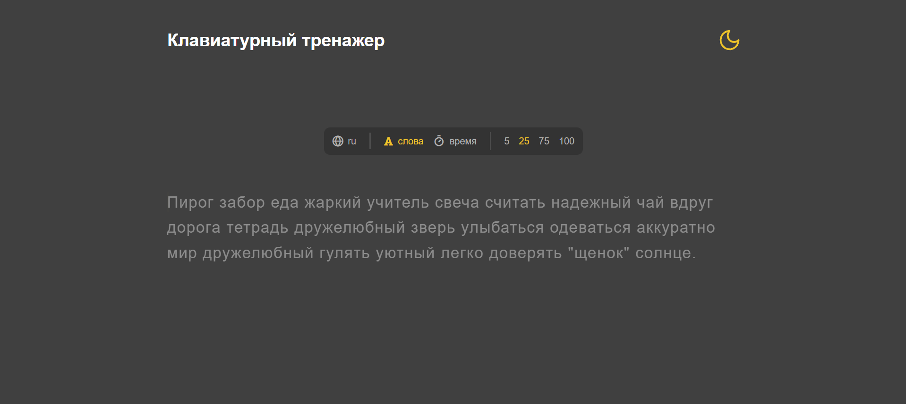

# Typing Test App

Web-application for practicing your typing speed, inspired by **Monkeytype**



## Branches

- `main` – current version, frontend-only version of app written in vanilla TypeScript
- `react-go-rewrite` – planning: full-stack application rewritten on React (client) and Go (server)

## Tech Stack

|              | Vanilla TypeScript version  | Full-stack version (later) |
| :----------- | :-------------------------: | :------------------------: |
| **Frontend** | HTML, CSS, Vite, TypeScript |  Vite, React, TypeScript   |
| **Backend**  |              —              |             Go             |
| **Storage**  |        LocalStorage         |  LocalStorage, PostgreSQL  |

## Features

- Configurable settings (words / time / language)
- Calculating WPM, CPM and accuracy after the test is finished
- Saving settings in LocalStorage

## Getting Started

```bash
git clone https://github.com/Melon4521/typing-test.git
cd typing-test
npm install
npm run dev
```

## Project Structure

```
├── src/
│   ├── assets/    # fonts and icons
│   ├── core/      # main test logic, types
│   ├── css/       # styles
│   ├── render/    # DOM-rendering
│   ├── settings/  # settings panel initialization and LocalStorage interface
│   └── text/      # texts generation
```

## Roadmap

- [ ] Finish migration from vanilla JS to TypeScript (**main**)
- [ ] End of a test with stats (**main**)
- [ ] React + TypeScript frontend (**react-go-rewrite**)
- [ ] Backend on Go with user authorization and saving tests history with PostgreSQL (**react-go-rewrite**)

## License

MIT
